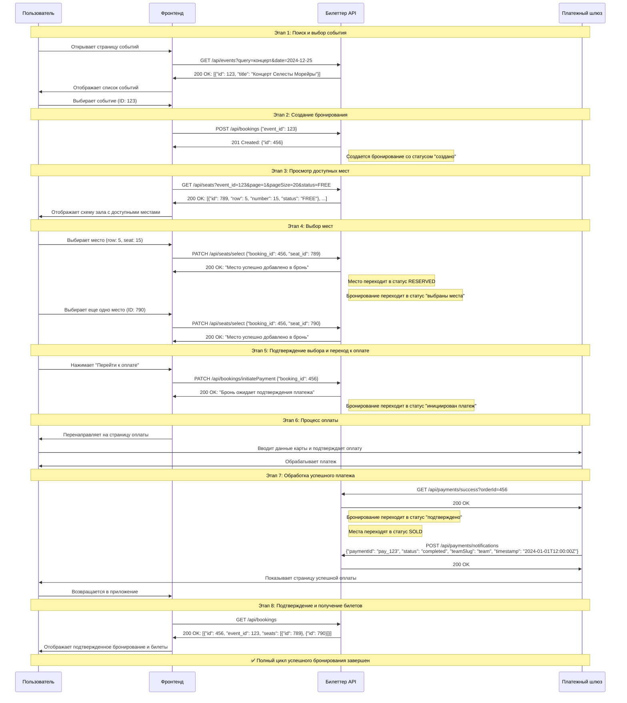

# HackLoad

## Диаграммы

Полный цикл успешного бронирования

```mermaid
sequenceDiagram
    participant User as Пользователь
    participant Frontend as Фронтенд
    participant Backend as Билеттер API
    participant PaymentGateway as Платежный шлюз
    
    Note over User, PaymentGateway: Этап 1: Поиск и выбор события
    
    User->>Frontend: Открывает страницу событий
    Frontend->>Backend: GET /api/events?query=концерт&date=2024-12-25
    Backend->>Frontend: 200 OK: [{"id": 123, "title": "Концерт Селесты Морейры"}]
    Frontend->>User: Отображает список событий
    User->>Frontend: Выбирает событие (ID: 123)
    
    Note over User, PaymentGateway: Этап 2: Создание бронирования
    
    Frontend->>Backend: POST /api/bookings {"event_id": 123}
    Backend->>Frontend: 201 Created: {"id": 456}
    Note right of Backend: Создается бронирование со статусом "создано"
    
    Note over User, PaymentGateway: Этап 3: Просмотр доступных мест
    
    Frontend->>Backend: GET /api/seats?event_id=123&page=1&pageSize=20&status=FREE
    Backend->>Frontend: 200 OK: [{"id": 789, "row": 5, "number": 15, "status": "FREE"}, ...]
    Frontend->>User: Отображает схему зала с доступными местами
    
    Note over User, PaymentGateway: Этап 4: Выбор мест
    
    User->>Frontend: Выбирает место (row: 5, seat: 15)
    Frontend->>Backend: PATCH /api/seats/select {"booking_id": 456, "seat_id": 789}
    Backend->>Frontend: 200 OK: "Место успешно добавлено в бронь"
    Note right of Backend: Место переходит в статус RESERVED
    Note right of Backend: Бронирование переходит в статус "выбраны места"
    
    User->>Frontend: Выбирает еще одно место (ID: 790)
    Frontend->>Backend: PATCH /api/seats/select {"booking_id": 456, "seat_id": 790}
    Backend->>Frontend: 200 OK: "Место успешно добавлено в бронь"
    
    Note over User, PaymentGateway: Этап 5: Подтверждение выбора и переход к оплате
    
    User->>Frontend: Нажимает "Перейти к оплате"
    Frontend->>Backend: PATCH /api/bookings/initiatePayment {"booking_id": 456}
    Backend->>Frontend: 200 OK: "Бронь ожидает подтверждения платежа"
    Note right of Backend: Бронирование переходит в статус "инициирован платеж"
    
    Note over User, PaymentGateway: Этап 6: Процесс оплаты
    
    Frontend->>User: Перенаправляет на страницу оплаты
    User->>PaymentGateway: Вводит данные карты и подтверждает оплату
    PaymentGateway->>User: Обрабатывает платеж
    
    Note over User, PaymentGateway: Этап 7: Обработка успешного платежа
    
    PaymentGateway->>Backend: GET /api/payments/success?orderId=456
    Backend->>PaymentGateway: 200 OK
    Note right of Backend: Бронирование переходит в статус "подтверждено"
    Note right of Backend: Места переходят в статус SOLD
    
    PaymentGateway->>Backend: POST /api/payments/notifications<br/>{"paymentId": "pay_123", "status": "completed", "teamSlug": "team", "timestamp": "2024-01-01T12:00:00Z"}
    Backend->>PaymentGateway: 200 OK
    
    PaymentGateway->>User: Показывает страницу успешной оплаты
    User->>Frontend: Возвращается в приложение
    
    Note over User, PaymentGateway: Этап 8: Подтверждение и получение билетов
    
    Frontend->>Backend: GET /api/bookings
    Backend->>Frontend: 200 OK: [{"id": 456, "event_id": 123, "seats": [{"id": 789}, {"id": 790}]}]
    Frontend->>User: Отображает подтвержденное бронирование и билеты
    
    Note over User, PaymentGateway: ✅ Полный цикл успешного бронирования завершен
```

Отмена бронирования на разных этапах

```mermaid
sequenceDiagram
    participant User as Пользователь
    participant Frontend as Фронтенд
    participant Backend as Билеттер API
    participant PaymentGateway as Платежный шлюз
    
    Note over User, PaymentGateway: Общая подготовка: создание бронирования
    
    User->>Frontend: Выбирает событие
    Frontend->>Backend: POST /api/bookings {"event_id": 123}
    Backend->>Frontend: 201 Created: {"id": 456}
    Note right of Backend: Статус: "создано"
    
    alt Сценарий 1: Отмена сразу после создания бронирования
        Note over User, PaymentGateway: 🚫 Отмена на этапе "создано" (без выбранных мест)
        
        User->>Frontend: Нажимает "Отменить бронирование"
        Frontend->>Backend: PATCH /api/bookings/cancel {"booking_id": 456}
        Backend->>Frontend: 200 OK: "Бронь успешно отменена"
        Note right of Backend: Бронирование удаляется или помечается как отмененное
        Frontend->>User: Показывает подтверждение отмены
        
    else Сценарий 2: Отмена после выбора мест
        Note over User, PaymentGateway: 🎪 Пользователь выбирает места
        
        Frontend->>Backend: GET /api/seats?event_id=123&status=FREE
        Backend->>Frontend: 200 OK: [{"id": 789, "row": 5, "number": 15, "status": "FREE"}]
        
        User->>Frontend: Выбирает место 1 (ID: 789)
        Frontend->>Backend: PATCH /api/seats/select {"booking_id": 456, "seat_id": 789}
        Backend->>Frontend: 200 OK: "Место успешно добавлено в бронь"
        Note right of Backend: Место 789: FREE → RESERVED
        
        User->>Frontend: Выбирает место 2 (ID: 790)
        Frontend->>Backend: PATCH /api/seats/select {"booking_id": 456, "seat_id": 790}
        Backend->>Frontend: 200 OK: "Место успешно добавлено в бронь"
        Note right of Backend: Место 790: FREE → RESERVED<br/>Статус бронирования: "выбраны места"
        
        Note over User, PaymentGateway: 🚫 Отмена после выбора мест
        
        User->>Frontend: Нажимает "Отменить бронирование"
        
        Frontend->>Backend: PATCH /api/seats/release {"seat_id": 789}
        Backend->>Frontend: 200 OK: "Место успешно освобождено"
        Note right of Backend: Место 789: RESERVED → FREE
        
        Frontend->>Backend: PATCH /api/seats/release {"seat_id": 790}
        Backend->>Frontend: 200 OK: "Место успешно освобождено"
        Note right of Backend: Место 790: RESERVED → FREE
        
        Frontend->>Backend: PATCH /api/bookings/cancel {"booking_id": 456}
        Backend->>Frontend: 200 OK: "Бронь успешно отменена"
        
        Frontend->>User: Показывает подтверждение отмены с освобождением мест
        
    else Сценарий 3: Отмена после инициации платежа (до оплаты)
        Note over User, PaymentGateway: 🎪 Подготовка к оплате
        
        Frontend->>Backend: GET /api/seats?event_id=123&status=FREE
        Backend->>Frontend: 200 OK: [{"id": 789, "row": 5, "number": 15, "status": "FREE"}]
        
        User->>Frontend: Выбирает места
        Frontend->>Backend: PATCH /api/seats/select {"booking_id": 456, "seat_id": 789}
        Backend->>Frontend: 200 OK: "Место успешно добавлено в бронь"
        
        User->>Frontend: Переходит к оплате
        Frontend->>Backend: PATCH /api/bookings/initiatePayment {"booking_id": 456}
        Backend->>Frontend: 200 OK: "Бронь ожидает подтверждения платежа"
        Note right of Backend: Статус: "инициирован платеж"
        
        Note over User, PaymentGateway: 🚫 Отмена во время ожидания платежа
        
        User->>Frontend: Нажимает "Отменить" на странице оплаты
        
        Frontend->>Backend: PATCH /api/seats/release {"seat_id": 789}
        Backend->>Frontend: 200 OK: "Место успешно освобождено"
        Note right of Backend: Место 789: RESERVED → FREE
        
        Frontend->>Backend: PATCH /api/bookings/cancel {"booking_id": 456}
        Backend->>Frontend: 200 OK: "Бронь успешно отменена"
        
        Frontend->>User: Перенаправляет на главную с сообщением об отмене
        
    else Сценарий 4: Автоматическая отмена при неуспешном платеже
        Note over User, PaymentGateway: 🎪 Полный процесс до платежа
        
        Frontend->>Backend: GET /api/seats?event_id=123&status=FREE
        Backend->>Frontend: 200 OK: [{"id": 789, "row": 5, "number": 15, "status": "FREE"}]
        
        User->>Frontend: Выбирает места и переходит к оплате
        Frontend->>Backend: PATCH /api/seats/select {"booking_id": 456, "seat_id": 789}
        Backend->>Frontend: 200 OK: "Место успешно добавлено в бронь"
        
        Frontend->>Backend: PATCH /api/bookings/initiatePayment {"booking_id": 456}
        Backend->>Frontend: 200 OK: "Бронь ожидает подтверждения платежа"
        
        User->>PaymentGateway: Пытается оплатить
        PaymentGateway->>User: Ошибка оплаты (недостаток средств/отклонена банком)
        
        Note over User, PaymentGateway: 🚫 Автоматическая отмена при неуспешном платеже
        
        PaymentGateway->>Backend: GET /api/payments/fail?orderId=456
        Backend->>PaymentGateway: 200 OK
        Note right of Backend: Место 789: RESERVED → FREE<br/>Статус бронирования: "отменено"<br/>Автоматическое освобождение всех мест
        
        PaymentGateway->>Backend: POST /api/payments/notifications<br/>{"paymentId": "pay_123", "status": "failed", "teamSlug": "team"}
        Backend->>PaymentGateway: 200 OK
        
        PaymentGateway->>User: Показывает страницу ошибки оплаты
        User->>Frontend: Возвращается в приложение
        Frontend->>User: Показывает сообщение об отмене из-за ошибки оплаты
        
    else Сценарий 5: Отмена подтвержденного бронирования (возврат)
        Note over User, PaymentGateway: 🎪 Успешное бронирование
        
        Frontend->>Backend: GET /api/seats?event_id=123&status=FREE
        Backend->>Frontend: 200 OK: [{"id": 789, "row": 5, "number": 15, "status": "FREE"}]
        
        User->>Frontend: Полный цикл бронирования
        Frontend->>Backend: PATCH /api/seats/select {"booking_id": 456, "seat_id": 789}
        Backend->>Frontend: 200 OK: "Место успешно добавлено в бронь"
        
        Frontend->>Backend: PATCH /api/bookings/initiatePayment {"booking_id": 456}
        Backend->>Frontend: 200 OK: "Бронь ожидает подтверждения платежа"
        
        User->>PaymentGateway: Успешная оплата
        PaymentGateway->>Backend: GET /api/payments/success?orderId=456
        Backend->>PaymentGateway: 200 OK
        Note right of Backend: Место 789: RESERVED → SOLD<br/>Статус: "подтверждено"
        
        Note over User, PaymentGateway: 🚫 Запрос возврата уже оплаченного билета
        
        User->>Frontend: Запрашивает возврат билета
        Frontend->>Backend: PATCH /api/bookings/cancel {"booking_id": 456}
        Backend->>Frontend: 200 OK: "Бронь успешно отменена"
        Note right of Backend: Место 789: SOLD → FREE<br/>Инициируется процесс возврата средств
        
        Backend->>PaymentGateway: Запрос возврата средств
        PaymentGateway->>Backend: Подтверждение возврата
        PaymentGateway->>User: Уведомление о возврате средств
        
        Frontend->>User: Подтверждение отмены и информация о возврате
    end
    
    Note over User, PaymentGateway: ✅ Все сценарии отмены обработаны
```

