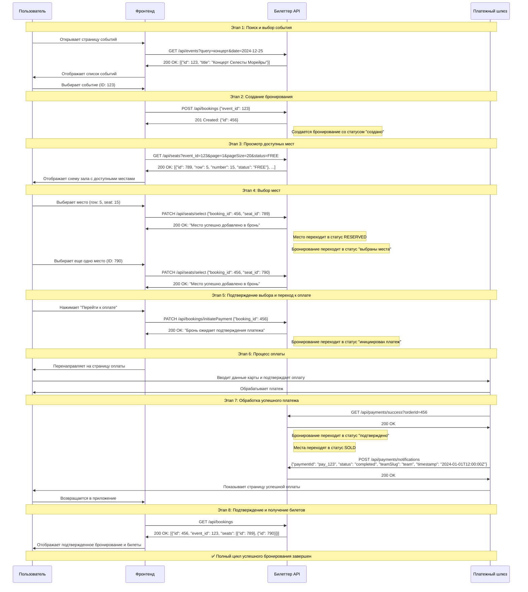
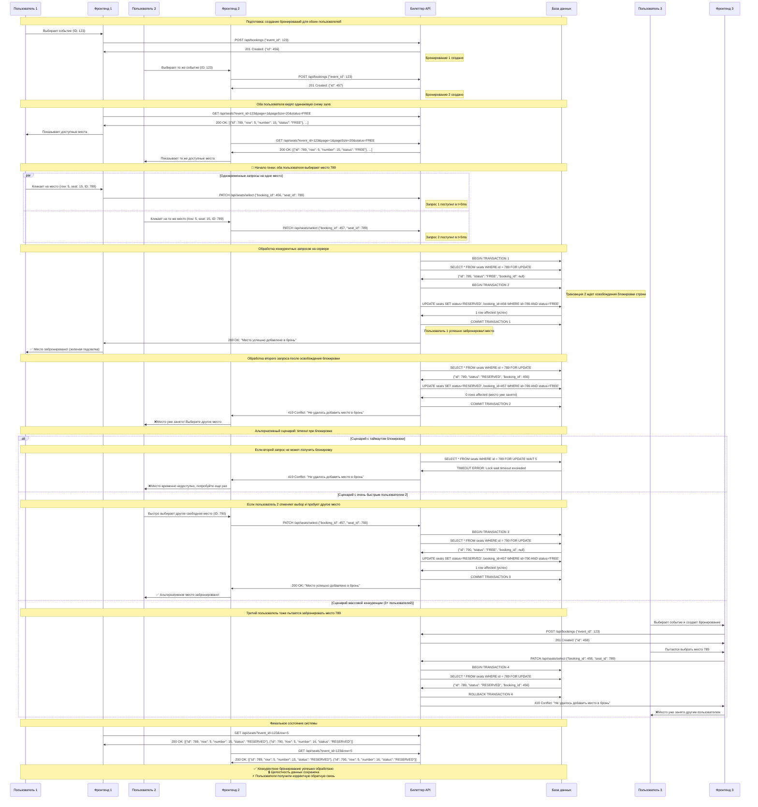

```mermaid
sequenceDiagram
    participant User as Пользователь
    participant Frontend as Фронтенд
    participant Backend as Билеттер API
    participant PaymentGateway as Платежный шлюз
    
    Note over User, PaymentGateway: Общая подготовка: создание бронирования
    
    User->>Frontend: Выбирает событие
    Frontend->>Backend: POST /api/bookings {"event_id": 123}
    Backend->>Frontend: 201 Created: {"id": 456}
    Note right of Backend: Статус: "создано"
    
    alt Сценарий 1: Отмена сразу после создания бронирования
        Note over User, PaymentGateway: 🚫 Отмена на этапе "создано" (без выбранных мест)
        
        User->>Frontend: Нажимает "Отменить бронирование"
        Frontend->>Backend: PATCH /api/bookings/cancel {"booking_id": 456}
        Backend->>Frontend: 200 OK: "Бронь успешно отменена"
        Note right of Backend: Бронирование удаляется или помечается как отмененное
        Frontend->>User: Показывает подтверждение отмены
        
    else Сценарий 2: Отмена после выбора мест
        Note over User, PaymentGateway: 🎪 Пользователь выбирает места
        
        Frontend->>Backend: GET /api/seats?event_id=123&status=FREE
        Backend->>Frontend: 200 OK: [{"id": 789, "row": 5, "number": 15, "status": "FREE"}]
        
        User->>Frontend: Выбирает место 1 (ID: 789)
        Frontend->>Backend: PATCH /api/seats/select {"booking_id": 456, "seat_id": 789}
        Backend->>Frontend: 200 OK: "Место успешно добавлено в бронь"
        Note right of Backend: Место 789: FREE → RESERVED
        
        User->>Frontend: Выбирает место 2 (ID: 790)
        Frontend->>Backend: PATCH /api/seats/select {"booking_id": 456, "seat_id": 790}
        Backend->>Frontend: 200 OK: "Место успешно добавлено в бронь"
        Note right of Backend: Место 790: FREE → RESERVED<br/>Статус бронирования: "выбраны места"
        
        Note over User, PaymentGateway: 🚫 Отмена после выбора мест
        
        User->>Frontend: Нажимает "Отменить бронирование"
        
        Frontend->>Backend: PATCH /api/seats/release {"seat_id": 789}
        Backend->>Frontend: 200 OK: "Место успешно освобождено"
        Note right of Backend: Место 789: RESERVED → FREE
        
        Frontend->>Backend: PATCH /api/seats/release {"seat_id": 790}
        Backend->>Frontend: 200 OK: "Место успешно освобождено"
        Note right of Backend: Место 790: RESERVED → FREE
        
        Frontend->>Backend: PATCH /api/bookings/cancel {"booking_id": 456}
        Backend->>Frontend: 200 OK: "Бронь успешно отменена"
        
        Frontend->>User: Показывает подтверждение отмены с освобождением мест
        
    else Сценарий 3: Отмена после инициации платежа (до оплаты)
        Note over User, PaymentGateway: 🎪 Подготовка к оплате
        
        Frontend->>Backend: GET /api/seats?event_id=123&status=FREE
        Backend->>Frontend: 200 OK: [{"id": 789, "row": 5, "number": 15, "status": "FREE"}]
        
        User->>Frontend: Выбирает места
        Frontend->>Backend: PATCH /api/seats/select {"booking_id": 456, "seat_id": 789}
        Backend->>Frontend: 200 OK: "Место успешно добавлено в бронь"
        
        User->>Frontend: Переходит к оплате
        Frontend->>Backend: PATCH /api/bookings/initiatePayment {"booking_id": 456}
        Backend->>Frontend: 200 OK: "Бронь ожидает подтверждения платежа"
        Note right of Backend: Статус: "инициирован платеж"
        
        Note over User, PaymentGateway: 🚫 Отмена во время ожидания платежа
        
        User->>Frontend: Нажимает "Отменить" на странице оплаты
        
        Frontend->>Backend: PATCH /api/seats/release {"seat_id": 789}
        Backend->>Frontend: 200 OK: "Место успешно освобождено"
        Note right of Backend: Место 789: RESERVED → FREE
        
        Frontend->>Backend: PATCH /api/bookings/cancel {"booking_id": 456}
        Backend->>Frontend: 200 OK: "Бронь успешно отменена"
        
        Frontend->>User: Перенаправляет на главную с сообщением об отмене
        
    else Сценарий 4: Автоматическая отмена при неуспешном платеже
        Note over User, PaymentGateway: 🎪 Полный процесс до платежа
        
        Frontend->>Backend: GET /api/seats?event_id=123&status=FREE
        Backend->>Frontend: 200 OK: [{"id": 789, "row": 5, "number": 15, "status": "FREE"}]
        
        User->>Frontend: Выбирает места и переходит к оплате
        Frontend->>Backend: PATCH /api/seats/select {"booking_id": 456, "seat_id": 789}
        Backend->>Frontend: 200 OK: "Место успешно добавлено в бронь"
        
        Frontend->>Backend: PATCH /api/bookings/initiatePayment {"booking_id": 456}
        Backend->>Frontend: 200 OK: "Бронь ожидает подтверждения платежа"
        
        User->>PaymentGateway: Пытается оплатить
        PaymentGateway->>User: Ошибка оплаты (недостаток средств/отклонена банком)
        
        Note over User, PaymentGateway: 🚫 Автоматическая отмена при неуспешном платеже
        
        PaymentGateway->>Backend: GET /api/payments/fail?orderId=456
        Backend->>PaymentGateway: 200 OK
        Note right of Backend: Место 789: RESERVED → FREE<br/>Статус бронирования: "отменено"<br/>Автоматическое освобождение всех мест
        
        PaymentGateway->>Backend: POST /api/payments/notifications<br/>{"paymentId": "pay_123", "status": "failed", "teamSlug": "team"}
        Backend->>PaymentGateway: 200 OK
        
        PaymentGateway->>User: Показывает страницу ошибки оплаты
        User->>Frontend: Возвращается в приложение
        Frontend->>User: Показывает сообщение об отмене из-за ошибки оплаты
        
    else Сценарий 5: Отмена подтвержденного бронирования (возврат)
        Note over User, PaymentGateway: 🎪 Успешное бронирование
        
        Frontend->>Backend: GET /api/seats?event_id=123&status=FREE
        Backend->>Frontend: 200 OK: [{"id": 789, "row": 5, "number": 15, "status": "FREE"}]
        
        User->>Frontend: Полный цикл бронирования
        Frontend->>Backend: PATCH /api/seats/select {"booking_id": 456, "seat_id": 789}
        Backend->>Frontend: 200 OK: "Место успешно добавлено в бронь"
        
        Frontend->>Backend: PATCH /api/bookings/initiatePayment {"booking_id": 456}
        Backend->>Frontend: 200 OK: "Бронь ожидает подтверждения платежа"
        
        User->>PaymentGateway: Успешная оплата
        PaymentGateway->>Backend: GET /api/payments/success?orderId=456
        Backend->>PaymentGateway: 200 OK
        Note right of Backend: Место 789: RESERVED → SOLD<br/>Статус: "подтверждено"
        
        Note over User, PaymentGateway: 🚫 Запрос возврата уже оплаченного билета
        
        User->>Frontend: Запрашивает возврат билета
        Frontend->>Backend: PATCH /api/bookings/cancel {"booking_id": 456}
        Backend->>Frontend: 200 OK: "Бронь успешно отменена"
        Note right of Backend: Место 789: SOLD → FREE<br/>Инициируется процесс возврата средств
        
        Backend->>PaymentGateway: Запрос возврата средств
        PaymentGateway->>Backend: Подтверждение возврата
        PaymentGateway->>User: Уведомление о возврате средств
        
        Frontend->>User: Подтверждение отмены и информация о возврате
    end
    
    Note over User, PaymentGateway: ✅ Все сценарии отмены обработаны
```

# HackLoad

## Важные репозиторий

Внешн. сервисы:
- https://github.com/hackload-kz/service-provider
- https://github.com/hackload-kz/payment

DeepWiki:
- https://deepwiki.com/hackload-kz/service-provider
- https://deepwiki.com/hackload-kz/payment

Данные:
- https://github.com/hackload-kz/data

Инфра:
- https://github.com/hackload-kz/infra
- https://registry.terraform.io/providers/terraform-provider-openstack/openstack/latest/docs

## Billetter API

### Диаграммы

<details>
<summary>Полный цикл успешного бронирования</summary>


</details>

<details>

<summary>Отмена бронирования на разных этапах</summary>



</details>

<details>

<summary>Конкурентное бронирование одного места</summary>



</details>

## Event Provider Documentation

### Диаграммы

<details>

<summary>TODO</summary>



</details>

```mermaid
sequenceDiagram
    participant Partner as Partner
    participant API as Hackload API
    participant DB as Database
    participant Admin as Administrator

    Note over Partner, Admin: Initial Setup Phase
    Admin->>+API: POST /api/admin/v1/places
    API->>+DB: Create venue places
    DB-->>-API: Places created
    API-->>-Admin: 201 Created

    Note over Partner, DB: Main Order Workflow
    
    rect rgb(240, 248, 255)
        Note over Partner, DB: 1. Order Creation
        Partner->>+API: POST /api/partners/v1/orders
        API->>+DB: Create new order (STARTED)
        DB-->>-API: Order ID generated
        API-->>-Partner: 201 Created {order_id}
    end

    rect rgb(248, 255, 240)
        Note over Partner, DB: 2. Browse Available Places
        Partner->>+API: GET /api/partners/v1/places?page=1&pageSize=20
        API->>+DB: Query available places
        DB-->>-API: Places list with is_free status
        API-->>-Partner: 200 OK [places array]

        Partner->>+API: GET /api/partners/v1/places/{id}
        API->>+DB: Get specific place details
        DB-->>-API: Place details
        API-->>-Partner: 200 OK {place details}
    end

    rect rgb(255, 248, 240)
        Note over Partner, DB: 3. Place Selection
        Partner->>+API: PATCH /api/partners/v1/places/{id}/select
        Note right of API: Validate: place is free,<br/>order is STARTED
        alt Place is free and order is valid
            API->>+DB: Reserve place for order
            DB->>DB: Set is_free=false, link to order
            DB-->>-API: Place reserved
            API-->>-Partner: 204 No Content
        else Place already selected
            API-->>Partner: 409 PlaceAlreadySelectedException
        else Order not started
            API-->>Partner: 409 OrderNotStartedException
        end
    end

    rect rgb(255, 240, 248)
        Note over Partner, DB: 4. Order Management
        Partner->>+API: GET /api/partners/v1/orders/{id}
        API->>+DB: Get order details
        DB-->>-API: Order with places_count
        API-->>-Partner: 200 OK {order details}

        opt Release place if needed
            Partner->>+API: PATCH /api/partners/v1/places/{id}/release
            alt Place belongs to partner's order
                API->>+DB: Release place
                DB->>DB: Set is_free=true, unlink from order
                DB-->>-API: Place released
                API-->>-Partner: 204 No Content
            else Place belongs to another order
                API-->>Partner: 403 PlaceSelectedForAnotherOrderException
            end
        end
    end

    rect rgb(248, 240, 255)
        Note over Partner, DB: 5. Order Submission
        Partner->>+API: PATCH /api/partners/v1/orders/{id}/submit
        alt Order has places
            API->>+DB: Update order status to SUBMITTED
            DB-->>-API: Order submitted
            API-->>-Partner: 200 OK
        else No places in order
            API-->>Partner: 409 NoPlacesAddedException
        end
    end

    rect rgb(240, 255, 248)
        Note over Partner, DB: 6. Final Actions
        alt Confirm Order
            Partner->>+API: PATCH /api/partners/v1/orders/{id}/confirm
            alt Order is submitted
                API->>+DB: Update order status to CONFIRMED
                DB-->>-API: Order confirmed (terminal)
                API-->>-Partner: 200 OK
            else Order not submitted
                API-->>Partner: 409 OrderNotSubmittedException
            end
        else Cancel Order
            Partner->>+API: PATCH /api/partners/v1/orders/{id}/cancel
            alt Order not confirmed
                API->>+DB: Update order status to CANCELLED
                DB->>DB: Release all places in order
                DB-->>-API: Order cancelled, places freed
                API-->>-Partner: 200 OK
            else Order already confirmed
                API-->>Partner: 409 ConfirmedOrderCanNotBeCancelledException
            end
        end
    end

    Note over Partner, DB: Order State Transitions
    Note over API: STARTED → SUBMITTED → CONFIRMED (terminal)
    Note over API: STARTED/SUBMITTED → CANCELLED (terminal)
```

## Модель данных

Основные сущности: пользователи, события и места.

```sql
CREATE TABLE "users" (
    "user_id" INTEGER PRIMARY KEY,
    "email" TEXT UNIQUE NOT NULL,
    "password_hash" TEXT NOT NULL,
    "password_plain" TEXT,  -- For testing purposes only, would not exist in production
    "first_name" TEXT NOT NULL,
    "surname" TEXT NOT NULL,
    "birthday" DATE,
    "registered_at" TIMESTAMP NOT NULL,
    "is_active" BOOLEAN NOT NULL,
    "last_logged_in" TIMESTAMP NOT NULL
);

CREATE TABLE "events_archive" (
    "id" INTEGER PRIMARY KEY,
    "title" TEXT,
    "description" TEXT,

    -- Enum: 'film', 'cinema', 'stage', 'game'
    "type" TEXT, 

    -- Пример: 2025-12-15T20:00:00
    "datetime_start" TIMESTAMP NOT NULL, 

    -- Используется для поиска
    -- Пример: 2025-12-15
    "date_start" DATE GENERATED ALWAYS AS (date("datetime_start")) STORED,

    -- Enum: 'Билеттер', 'TicketRu', 'EventWorld', 'ShowTime'
    "provider" TEXT
);

CREATE TABLE "seats" (
    "id" INTEGER PRIMARY KEY AUTOINCREMENT,
    "event_id" INTEGER NOT NULL references "events_archive"("id"),

    -- ID в Ticket Provider Service
    "external_id" TEXT,
    
    -- Ряд: номер ряда (integer)
    "row" INTEGER NOT NULL,
    
    -- Номер: номер места в ряду (integer)
    "number" INTEGER NOT NULL,

    -- Пример: 15.00
    "price" TEXT NOT NULL,
    
    -- Статус: FREE, RESERVED, SOLD
    "status" TEXT NOT NULL
);
```

Бронирования пользователей:

```sql
CREATE TABLE "bookings" (
    "id" INTEGER PRIMARY KEY AUTOINCREMENT,
    "user_id" INTEGER NOT NULL references "users"("user_id"),
    "event_id" INTEGER NOT NULL references "events_archive"("id"),

    -- Статус: CREATED, PAYMENT_INITIATED, CONFIRMED, CANCELLED
    "status" TEXT DEFAULT 'CREATED'
);

CREATE TABLE "booking_seats" (
    "user_id" INTEGER NOT NULL references "users"("user_id"),
    "booking_id" INTEGER NOT NULL references "bookings"("id"),
    "seat_id" INTEGER NOT NULL references "seats"("id"),

    -- Композитный первичный ключ
    PRIMARY KEY ("booking_id", "seat_id"),
    
    -- Уникальность места во всей системе
    UNIQUE ("seat_id")
);
```

Оплаты пользователей:

```sql
create table "booking_payments" (
    "id" INTEGER PRIMARY KEY AUTOINCREMENT,
    "booking_id" INTEGER NOT NULL references "bookings"("id"),
    "order_id" TEXT NOT NULL,

    -- Статус: INIT, SUCCESS, FAIL
    "status" TEXT DEFAULT 'INIT'
);
```

Заказы пользователей в Ticket Provider Service:

```sql
create table "booking_orders" (
    "id" INTEGER PRIMARY KEY AUTOINCREMENT,
    "booking_id" INTEGER NOT NULL references "bookings"("id"),
    "order_id" TEXT NOT NULL,

    -- Статус: STARTED, SUBMITTED, CONFIRMED, CANCELLED
    "status" TEXT DEFAULT 'INIT'
);
```


## Заметки

- Проводить предзагрузку всех мест из Ticketing Provider Service
